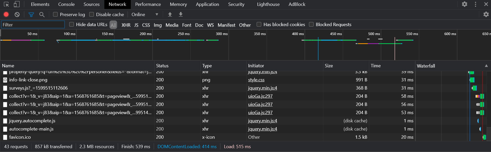
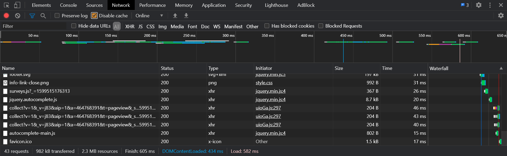
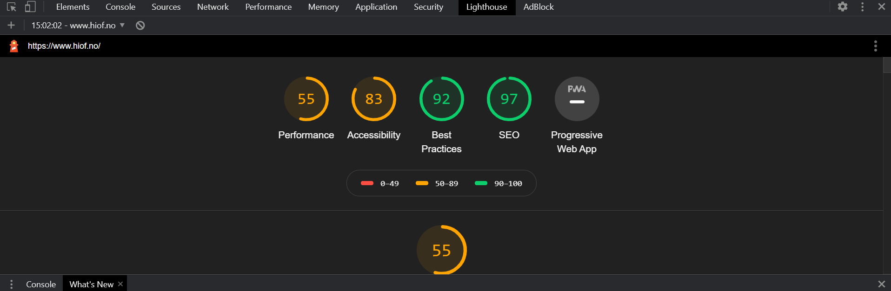
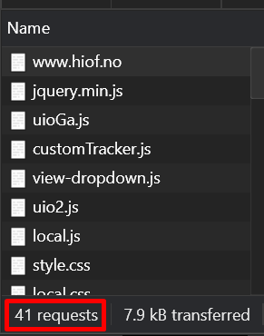
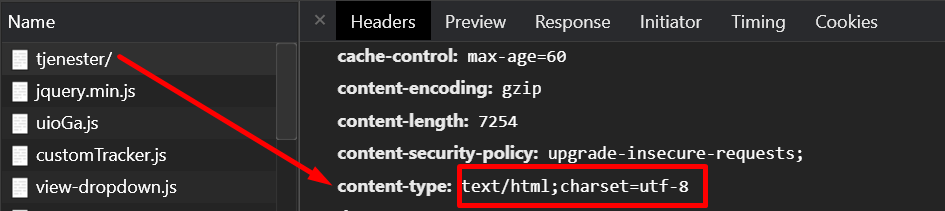
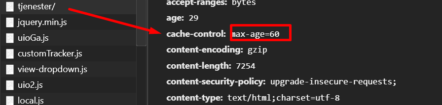
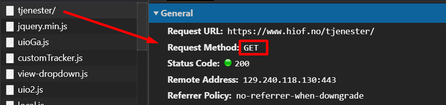

# Chrome (Oppgave 4)
* Antall bilder på forsiden
- Brukte 'window.document.querySelectorAll('img')' og fant ut at det var 4 bilder på siden
* Lastetid med og uten cache
- Med cache: 539 ms
- 
- Uten cache: 605 ms
- 
* Audit
- 
* Antall eksterne requests
- Denne siden bruker 41 eksterne requests.
- 
* Hva er "Content-Type" i response header på https://www.hiof.no/tjenester/
-  
* Hva er "Cache-Control" i request header på https://www.hiof.no/tjenester/
-  
* Hvilken protokoll bruker den siden?
-  